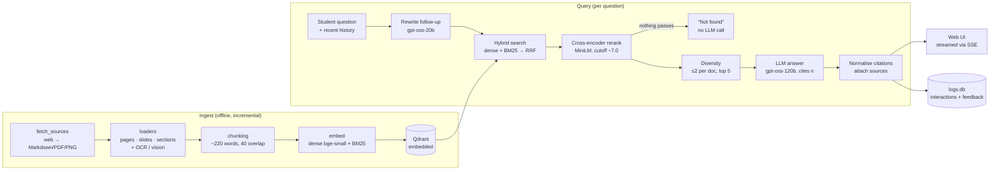

# Course RAG: Project Report

A retrieval-augmented teaching assistant that answers students' questions only from indexed course material, with every claim cited to the exact page, slide or section it came from.

---

## Contents

1. [Summary](#1-summary)
2. [Problem and goals](#2-problem-and-goals)
3. [Corpus and courses](#3-corpus-and-courses)
4. [System architecture](#4-system-architecture)
5. [Technology choices](#5-technology-choices)
6. [Ingestion pipeline](#6-ingestion-pipeline)
7. [Query pipeline](#7-query-pipeline)
8. [Conversation handling](#8-conversation-handling)
9. [API](#9-api)
10. [Data model](#10-data-model)
11. [Configuration reference](#11-configuration-reference)
12. [Evaluation](#12-evaluation)
13. [Design decisions and trade-offs](#13-design-decisions-and-trade-offs)
14. [Operations](#14-operations)
15. [Security and privacy](#15-security-and-privacy)
16. [Limitations and future work](#16-limitations-and-future-work)
17. [Repository layout](#17-repository-layout)
18. [Licensing](#18-licensing)

---

## 1. Summary

Students choose a course and ask questions in plain English, including follow-ups such as "give me an example of that". The system:

- searches the course material with **hybrid retrieval** (dense embeddings and BM25 keywords merged by reciprocal rank fusion),
- re-scores the candidates with a **cross-encoder reranker**, which also decides whether the answer exists in the course at all,
- has an LLM write the answer **only from the retrieved excerpts**, citing them as `[n]`,
- links every citation to its source: the original web page, or the exact PDF page or PowerPoint slide of a local file.

The whole stack runs on free components. Embeddings, BM25, the reranker and OCR run locally. Qdrant runs embedded on disk. The LLM is any OpenAI-compatible endpoint (Groq by default).

**Headline results** (78 evaluation questions across three courses):

| Metric | Result |
|---|---|
| Retrieval hit@1 | 94.9% |
| Retrieval hit@5 | 100% |
| Mean reciprocal rank | 0.972 |
| Off-topic questions declined | 100% (8/8) |
| Answers citing the expected source (24-question sample) | 100% |
| Multi-turn follow-ups citing the expected source | 100% (4/4) |
| Median retrieval latency | ~450 ms (CPU) |

---

## 2. Problem and goals

General-purpose chatbots answer course questions fluently but unreliably. They may contradict the course's own definitions and notation, invent details, and give students no way to check the answer against the material.

**Goals**

| Goal | How it is met |
|---|---|
| Answers grounded only in course material | Strict system prompt plus a relevance gate that blocks the LLM entirely when nothing relevant is found |
| Verifiable answers | `[n]` citations with document, page/slide/section, source URL, license and the excerpt itself |
| Honest "I don't know" | Calibrated reranker cutoff; off-topic questions are declined without an LLM call |
| Natural conversation | Follow-ups rewritten into standalone search queries; recent history passed to the LLM |
| Mixed document types | PDF, DOCX, PPTX, Markdown, TXT, HTML and images, with OCR for scans and pictures |
| Easy to maintain | Incremental ingest, declarative course registry, upload endpoint |
| Measurable and improvable | Evaluation harness, interaction log, student feedback loop |
| Zero cost to run | Local models and embedded DB; free-tier LLM |

**Non-goals.** The system does not answer general-knowledge questions, grade assignments, or keep per-user sessions on the server.

---

## 3. Corpus and courses

Courses are declared in `config/courses.yaml`. Each course has an `id`, `name`, `description`, a `docs_dir`, and an optional list of web `sources`.

| Course id | Name | Documents | Material |
|---|---|---|---|
| `ai` | Artificial Intelligence | 14 (13 pages, 1 diagram) | Wikipedia: AI, intelligent agents, A* search, knowledge representation, reinforcement learning, LLMs, transformers, RAG, AI ethics. *Dive into Deep Learning*: queries/keys/values, the Transformer, BERT, MDPs. Neural network diagram. |
| `ml` | Machine Learning | 22 (18 pages, 4 diagrams) | Wikipedia: ML, supervised/unsupervised learning, overfitting, bias–variance, cross-validation, decision trees, random forests, SVMs, k-means, gradient descent, precision and recall. *D2L*: linear and softmax regression, MLPs, generalization, gradient descent, convolutions. Diagrams: precision/recall, overfitting, kernel trick, gradient descent. |
| `data-analytics` | Data Analytics | 18 (17 pages, 1 diagram) | OpenIntro *Introduction to Modern Statistics*: hello data, study design, categorical and numerical EDA, simple and multiple regression, randomization, decision errors, two-means inference. Wikipedia: data analysis, EDA, descriptive statistics, data cleansing, visualisation, SQL, pandas, hypothesis tests. Box plot diagram. |

All web material is CC BY-SA or public domain. Downloaded files live under `data/courses/<id>/web/`, which is **git-ignored**. Regenerate them with `python -m scripts.fetch_sources --all`.

---

## 4. System architecture



| Module | Responsibility |
|---|---|
| `app/config.py` | Settings (pydantic-settings, `.env`) and course registry loader |
| `app/loaders.py` | Turns each file into citable units (page / slide / heading section) |
| `app/vision.py` | Local OCR (RapidOCR) and optional vision-LLM figure descriptions |
| `app/chunking.py` | Sentence-aware chunking that never crosses unit boundaries |
| `app/store.py` | Embedding models, Qdrant collection, upsert, hybrid search with RRF |
| `app/rerank.py` | Cross-encoder reranking |
| `app/rag.py` | Query rewriting, retrieval pipeline, prompt building, citation post-processing |
| `app/llm.py` | OpenAI-compatible clients (chat, streaming, vision) |
| `app/ingest.py` | Incremental indexing of a course folder |
| `app/logs.py` | SQLite interaction log and feedback |
| `app/api.py` | FastAPI app: ask, stream, feedback, admin, file serving, upload |
| `app/static/index.html` | Single-page chat UI |
| `scripts/` | CLI tools: `fetch_sources`, `ingest`, `feedback` |
| `eval/` | Question set, evaluation harness, saved results |

---

## 5. Technology choices

| Concern | Choice | Why |
|---|---|---|
| Dense embeddings | `BAAI/bge-small-en-v1.5` (384-dim, quantised ONNX via fastembed) | Strong retrieval quality for its size; runs fast on CPU with no GPU or API cost |
| Keyword vectors | `Qdrant/bm25` sparse vectors with IDF modifier | Exact-term matching for identifiers, acronyms and short queries |
| Reranker | `Xenova/ms-marco-MiniLM-L-6-v2` cross-encoder | Best accuracy/latency trade-off in testing; produces scores that separate on-topic from off-topic questions |
| Vector store | Qdrant, embedded mode (`storage/qdrant`) | Named dense + sparse vectors in one point, payload filters, zero infrastructure; moves to a server by setting `QDRANT_URL` |
| OCR | RapidOCR (ONNX) | Free, offline, good enough for labels and formulas in figures |
| Figure understanding | Optional vision LLM (`VISION_MODEL`) | Diagrams without text need a description to be searchable; cost is paid once at ingest |
| LLM | `openai/gpt-oss-120b` on Groq (answers), `openai/gpt-oss-20b` (query rewriting) | Free tier, fast inference; any OpenAI-compatible provider can be swapped in |
| Web extraction | trafilatura | Extracts main content only, as Markdown with headings preserved |
| API | FastAPI + Uvicorn, server-sent events | Async streaming, typed request validation |
| Logging | SQLite | Zero setup, easy to query, adequate for course-scale traffic |

---

## 6. Ingestion pipeline

### 6.1 Fetching web sources (`scripts/fetch_sources.py`)

- Downloads each URL in a course's `sources` into `<docs_dir>/web/`.
- **Respectful crawling:** checks `robots.txt` with the project's own user agent, and treats a 401/403 on robots.txt as "disallow all". Backs off on 429/503, honouring `Retry-After` and otherwise waiting 5 s × 2ⁿ.
- **HTML** is saved as clean Markdown (main content only). Footnote markers such as `[1]` and `[citation needed]` are removed because they look identical to the assistant's `[n]` citations. **PDFs and images** are saved as-is.
- File names are a slug of the title plus a 6-character URL hash, so they are stable and collision-free.
- `_manifest.json` records each file's URL, title and license; these flow into citations.
- A URL removed from the config deletes its file, and the next ingest removes it from the index.

### 6.2 Loading into citable units (`app/loaders.py`)

Every file becomes a list of `Unit(text, page, section)`. The unit is the smallest thing a citation can point to.

| Type | Unit | Details |
|---|---|---|
| PDF | Page | Pages with fewer than 30 extractable characters are treated as scans and their images are OCR'd |
| PPTX | Slide | Text frames, tables (rows joined with `|`), OCR of pictures, and speaker notes; slide title becomes the section |
| Markdown / HTML | Heading section | Headings inside code fences are ignored; HTML goes through trafilatura first |
| DOCX | Heading section | Paragraphs styled `Heading *` start a new section |
| TXT | Whole file | |
| Images | Whole image | OCR text, plus a vision-LLM description if configured |

Reference-list sections (`References`, `External links`, `See also`, `Notes`, `Bibliography`, etc.) are dropped. They add noise to search without answering anything.

Images smaller than 32 px on either side (icons, bullets) are skipped. OCR results below 0.5 confidence are discarded. A failed vision call falls back to OCR only and never fails the ingest.

### 6.3 Chunking (`app/chunking.py`)

- Target **220 words** with **40 words** of overlap.
- Splits on sentence boundaries so chunks don't end mid-thought. A single oversized "sentence" (tables, code) is still force-split.
- **Chunks never cross a page or section boundary.** This is what keeps every citation exact.

### 6.4 Indexing (`app/ingest.py`, `app/store.py`)

- Each chunk is embedded with its **document title and section prepended** ("Random forest — Bagging\n…"). Short or context-free chunks still match questions about their topic.
- Each Qdrant point stores two named vectors, `dense` (cosine) and `bm25` (sparse, IDF), plus a payload (see [§10](#10-data-model)).
- Point IDs are deterministic (`uuid5(doc_id#chunk_index)`), so re-indexing overwrites cleanly.
- Payload indexes on `course_id` and `doc_id` make course filtering and per-document deletion fast.
- **Incremental:** each file's SHA-256 is stored on its chunks. Unchanged files are skipped, changed files are deleted and re-indexed, and files no longer on disk are removed from the index. `--force` re-embeds everything; `--rebuild` drops the collection first (needed after an index format change).
- On startup the API checks the collection format and fails fast with a rebuild instruction if the index predates the hybrid format.

---

## 7. Query pipeline

Implemented in `app/rag.py`. `retrieve()` is shared by the API and the evaluation harness, so what is measured is exactly what runs in production.

1. **Rewrite.** If history is present, the rewrite model turns the latest message into a standalone question (temperature 0). The UI shows it as "Searched for: …".
2. **Hybrid search.** Dense and BM25 searches each return `RERANK_CANDIDATES` (12) chunks, filtered to the selected course(s). Results are merged with **reciprocal rank fusion**, `score = Σ 1 / (60 + rank)`. RRF uses rank positions only, so the two searches' incompatible score scales don't matter.
3. **Rerank.** The cross-encoder reads the question together with the first `RERANK_MAX_WORDS` (128) words of each candidate and re-scores it.
4. **Relevance gate.** Chunks scoring below `MIN_RERANK_SCORE` (−7.0) are dropped. If nothing survives and there is no conversation history, the reply is a fixed "couldn't find this in the course materials" message and **no LLM call is made**. If reranking is disabled, a dense-similarity cutoff (`MIN_SCORE`, 0.62) gates the query instead.
5. **Diversity.** At most `MAX_CHUNKS_PER_DOC` (2) chunks per document, up to `TOP_K` (5) in total, so answers don't lean on a single long page.
6. **Prompt.** Excerpts are numbered `[1]…[k]` with their location (title, page, section). Stray bracketed numbers inside excerpts are removed. The system prompt requires:
   - answering only from the excerpts and the established conversation,
   - citing every factual claim with this turn's excerpt numbers,
   - saying plainly when the answer isn't there,
   - referring to "the course material", not "excerpts" or "context".
7. **Generate.** Temperature 0.1, streamed token by token.
8. **Post-process.** Citation styles are normalised (`[[2]]`, `[2, 5]`, `【1】` → `[2][5]`). Only sources actually cited in the answer are returned, each with its excerpt and scores.

---

## 8. Conversation handling

- **Stateless server.** The browser holds the conversation and sends recent messages with each request. The server keeps the last `HISTORY_MESSAGES` (6). Nothing about a session is stored server-side.
- **Search uses the rewritten question; the answer uses the original.** The LLM sees the student's own wording, plus a note of the resolved intent when it differs.
- **Old citations are stripped from history.** `[n]` markers from earlier answers are removed so the model can't confuse last turn's sources with this turn's. History messages are clipped to 1,500 characters.
- **Conversational turns without new sources.** If nothing in the course matches a follow-up ("summarise that in one line", "thanks"), the model may answer briefly from the conversation alone without citations, or otherwise reply with the not-found message.
- **New chat** or switching course clears the history in the UI.

---

## 9. API

| Method | Path | Purpose |
|---|---|---|
| GET | `/` | Web UI |
| GET | `/courses` | List courses (id, name, description, sources) |
| POST | `/ask` | Ask a question; returns `{answer, citations[], search_query, id}` |
| POST | `/ask/stream` | Same request; server-sent events (see below) |
| POST | `/feedback` | `{id, rating: 1 or -1, comment?}` |
| GET | `/admin/interactions?rating=-1&limit=50` | Recent interactions with retrieval details (admin token) |
| GET | `/files/{path}` | Serve a cited local document (restricted to course folders and supported types) |
| POST | `/courses/{id}/documents` | Upload and index a file (admin token) |

**Ask request**

```json
{
  "question": "and what about recall?",
  "course_ids": ["ml"],
  "history": [
    {"role": "user", "content": "what is precision?"},
    {"role": "assistant", "content": "Precision is ..."}
  ]
}
```

Validation: question 2–2,000 characters; at most 50 history messages of up to 20,000 characters each. `course_ids` empty or null searches all courses; unknown ids return 404.

**Stream events** (`text/event-stream`, one JSON object per `data:` line)

| Event | Payload |
|---|---|
| `meta` | `{type, search_query}`, sent before generation starts |
| `delta` | `{type, text}`, one per generated piece |
| `done` | `{type, answer, citations, search_query, id}` |
| `error` | `{type, message}` if generation fails part-way |

**Citation object:** `id`, `doc_title`, `doc_id`, `course_id`, `page`, `section`, `source_path`, `source_url`, `license`, `text` (the excerpt), `score`, `dense_score`, `rerank_score`.

**Error mapping:** invalid or missing LLM key → 502; provider rate limit → 429; other provider errors → 502. Admin endpoints without a valid `X-Admin-Token` → 403. The upload endpoint is disabled unless `ADMIN_TOKEN` is set.

---

## 10. Data model

### Qdrant collection `course_chunks`

| Vector | Type |
|---|---|
| `dense` | 384-dim float, cosine distance |
| `bm25` | sparse, IDF modifier |

| Payload field | Description |
|---|---|
| `course_id` | Course id (indexed) |
| `doc_id` | `<course>/<relative path>` (indexed) |
| `doc_title` | From the manifest, or derived from the file name |
| `source_path` | Path relative to the repo root, for `/files/` links |
| `source_url` | Original URL for web sources |
| `license` | Source license |
| `file_hash` | SHA-256 of the file at index time |
| `chunk_index` | Position within the document |
| `page` | PDF page or PPTX slide number |
| `section` | Nearest heading or slide title |
| `text` | Chunk text (without the title prefix) |

### SQLite `storage/logs.db`, table `interactions`

| Column | Description |
|---|---|
| `id` | Interaction id returned to the client |
| `ts` | Unix timestamp |
| `course_ids` | JSON list |
| `question`, `search_query` | Original and rewritten question |
| `history_len` | Messages sent with the request |
| `retrieved` | JSON: title, section, final, dense and rerank score of each chunk given to the LLM |
| `answer`, `cited` | Answer text; JSON list of cited document titles |
| `latency_ms`, `model`, `error` | Operational data |
| `rating`, `comment` | Student feedback (+1 / −1) |

---

## 11. Configuration reference

All settings come from `.env` (see `.env.example`).

| Variable | Default | Purpose |
|---|---|---|
| `LLM_BASE_URL` | Groq OpenAI endpoint | Any OpenAI-compatible provider |
| `LLM_API_KEY` | — | Provider key |
| `LLM_MODEL` | `openai/gpt-oss-120b` | Answer model |
| `REWRITE_MODEL` | `LLM_MODEL` (example sets `openai/gpt-oss-20b`) | Follow-up rewriting |
| `HISTORY_MESSAGES` | 6 | Recent messages used per request |
| `VISION_MODEL` | off | Describe figures at ingest time |
| `VISION_BASE_URL`, `VISION_API_KEY` | LLM values | Separate vision provider |
| `EMBEDDING_MODEL` | `BAAI/bge-small-en-v1.5` | Dense embedding model |
| `QDRANT_PATH` | `storage/qdrant` | Embedded store location |
| `QDRANT_URL`, `QDRANT_API_KEY` | — | Use a Qdrant server / Qdrant Cloud instead |
| `CHUNK_SIZE_WORDS` / `CHUNK_OVERLAP_WORDS` | 220 / 40 | Re-index with `--force` after changing |
| `SEARCH_MODE` | `hybrid` | `hybrid` or `dense` |
| `RERANK_MODEL` | `Xenova/ms-marco-MiniLM-L-6-v2` | Empty disables reranking |
| `RERANK_CANDIDATES` | 12 | Candidates fetched and reranked |
| `RERANK_MAX_WORDS` | 128 | Words of each chunk the reranker reads |
| `MIN_RERANK_SCORE` | −7.0 | "Not in the course" cutoff |
| `TOP_K` | 5 | Chunks sent to the LLM |
| `MAX_CHUNKS_PER_DOC` | 2 | Diversity limit |
| `MIN_SCORE` | 0.62 | Dense cutoff, only used without a reranker |
| `LOG_INTERACTIONS` | true | Write to `storage/logs.db` |
| `ADMIN_TOKEN` | — | Enables upload and admin endpoints |

---

## 12. Evaluation

### 12.1 Method

`eval/questions.yaml` contains:

- **78 answerable questions** (AI 25, ML 28, Data Analytics 25), phrased the way students write: full questions, bare keywords ("description logic"), acronyms ("KeRF"), and paraphrases that avoid the source's wording ("how does a model figure out which words in a sentence relate to each other?"). Each lists the document title(s) that should answer it.
- **8 off-topic questions** that must be declined (sport, recipes, geography, taxes, translation, etc.).
- **4 multi-turn follow-ups**, where the last turn only makes sense with the earlier ones.

`python -m eval.run` measures retrieval through the same `retrieve()` function used in production:

- **hit@1 / hit@k:** an expected document is ranked first / appears in the results.
- **MRR:** mean of 1/rank of the first expected document.
- **Off-topic rejection:** share of off-topic questions for which retrieval returns nothing.
- **Calibration:** with the cutoff disabled, the lowest top scores among answerable questions and the highest among off-topic questions. The cutoff belongs in the gap between them.

`python -m eval.run --answers --sample N --delay S` additionally runs the LLM. It checks whether answers cite an expected document, whether they wrongly say "not found", whether off-topic questions are declined, and whether follow-ups cite the right source. Results are saved to `eval/results/<label>.json`.

### 12.2 Ablation

| Run | Search | Reranker | hit@1 | hit@k | MRR | Median latency |
|---|---|---|---|---|---|---|
| 1 | Dense | — | 88.5% | 96.2% | 0.915 | 13 ms |
| 2 | Hybrid | — | 89.7% | 96.2% | 0.929 | 49 ms |
| 3 | Dense | MiniLM, 128 words × 12 | 94.9% | 100% | 0.972 | 326 ms |
| 4 | Hybrid | MiniLM, 128 words × 12 | 94.9% | 100% | 0.972 | 493 ms |
| 5 | Hybrid | MiniLM, full chunk × 20 | 96.2% | 100% | 0.979 | 1,555 ms |
| 6 | Hybrid | MiniLM, 96 words × 12 | 93.6% | 98.7% | 0.957 | 388 ms |
| 7 | Hybrid | Jina tiny, 128 words × 12 | 92.3% | 100% | 0.953 | 399 ms |
| **8** | **Hybrid** | **MiniLM, 128 words × 12 (final)** | **94.9%** | **100%** | **0.972** | **454 ms** |

**Findings**

- **The reranker is the biggest single improvement** (+6 points hit@1, hit@k to 100%). The baseline's misses were short or keyword questions ("what is the F1 score?", "iloc", "frame problem") that dense similarity scored too low.
- **Reading full chunks** with more candidates gained 1 point of hit@1 at about 3× the latency. 128 words was kept. 96 words lost accuracy.
- **Hybrid search made no measurable difference on this corpus.** It is kept because real course material contains exact identifiers (assignment numbers, codes, formulas) where keyword matching matters. It can be turned off with `SEARCH_MODE=dense`.
- **MiniLM beat the Jina tiny reranker** on both accuracy and score separation.

Remaining rank-2/3 cases in the final run: "what is stochastic gradient descent?", "what does a JOIN do in SQL?", "description logic", and "how does a model figure out which words in a sentence relate to each other?". All of them still retrieved the expected document within the top 3.

### 12.3 Calibrating "not found"

Top scores with the cutoff disabled:

| Scoring | Lowest answerable | Highest off-topic | Separable? |
|---|---|---|---|
| Dense cosine | 0.605 | 0.594 | No (gap 0.01) |
| RRF (hybrid) | 0.030 | 0.033 | No (overlap) |
| MiniLM reranker | −5.80 | −8.18 | **Yes (gap 2.4)** |

Only the cross-encoder separates real questions from off-topic ones, so it, not the search step, decides whether to answer. `MIN_RERANK_SCORE = −7.0` sits in the middle of the gap. Runs 3–7 above show 0% off-topic rejection because the cutoff had not yet been moved to the reranker's scale. The final configuration declines 8/8.

### 12.4 End-to-end answers (run 9, 24-question sample)

| Metric | Result |
|---|---|
| Answers citing an expected document | 100% |
| Answerable questions wrongly declined | 0% |
| Off-topic questions declined | 100% |
| Follow-ups citing the expected document | 4/4 |

Examples of follow-up rewriting from this run: "how do I pick the number of clusters for it?" → "How do I pick the number of clusters for k-means clustering?"; "how is it different from GPT-style models?" → "How is BERT different from GPT-style models?". One rewrite returned the message unchanged ("and what about recall?"). Retrieval still succeeded because the keyword itself was enough, but it shows the rewrite step is not perfect.

---

## 13. Design decisions and trade-offs

| Decision | Rationale | Cost |
|---|---|---|
| Units before chunks; chunks never cross a page or section | Every citation points to an exact location | Some chunks are short; slightly more chunks overall |
| Title + section prefix on embedded text | Context-free chunks still match their topic | Prefix words count against the reranker's word budget |
| Reranker score as the relevance gate | Only score with clean separation between real and off-topic questions | ~400 ms extra per query on CPU |
| Rerank only 128 words of 12 candidates | Near-best accuracy at a third of the latency | An answer near the end of a chunk can be under-scored |
| No LLM call when nothing is relevant | Safe, instant and free for off-topic questions | None significant |
| Max 2 chunks per document | Answers draw on several sources; one long page can't dominate | May drop a third relevant chunk from the same page |
| Stateless server; client sends history | No session storage, trivial to scale horizontally (with a Qdrant server) | History is client-controlled (see §15) |
| Separate small model for rewriting | Lower latency and cost for a simple task | Occasionally returns the question unchanged |
| Strip footnote markers and old citations | Prevents confusion with this turn's `[n]` | None |
| Local models, embedded Qdrant | Zero cost and zero infrastructure | One process at a time; CPU latency |
| Vision descriptions at ingest, not query time | Pay once per image | ~2k tokens per image at ingest; requires `--force` re-index to enable |

---

## 14. Operations

### 14.1 Setup

```bash
python3 -m venv .venv && source .venv/bin/activate
pip install -r requirements.txt
cp .env.example .env            # set LLM_API_KEY
python -m scripts.fetch_sources --all
python -m scripts.ingest --all
uvicorn app.api:app --reload    # http://localhost:8000
```

Models are downloaded on first use into `storage/models/`.

### 14.2 Runbook

| Task | Command |
|---|---|
| Add a web source | Append its URL under the course's `sources`, then `fetch_sources --course <id>` and `ingest --course <id>` |
| Add a local file | Copy it into the course's `docs_dir`, then `ingest --course <id>` |
| Upload over HTTP | `curl -X POST localhost:8000/courses/<id>/documents -H "X-Admin-Token: $ADMIN_TOKEN" -F file=@notes.pdf` |
| Add a course | Add an entry to `courses.yaml`, then fetch and ingest it |
| Change chunking or embedding model | `ingest --all --force` |
| Index format changed | `ingest --all --rebuild` |
| Measure retrieval | `python -m eval.run --label <name>` |
| Measure answers | `python -m eval.run --answers --sample 24 --delay 20 --label <name>` |
| Review unhelpful answers | `python -m scripts.feedback` or `GET /admin/interactions?rating=-1` |

Embedded Qdrant allows one process at a time. Stop the server before running ingest from the CLI, or use the upload endpoint while it is running.

### 14.3 Improvement loop

1. Students rate answers with 👍/👎.
2. Review 👎 answers with `scripts/feedback`. Each shows the rewritten query, retrieved chunks with scores, and what was cited.
3. Diagnose:
   - wrong document retrieved → retrieval problem (chunking, query rewriting, missing content);
   - right document, bad answer → generation problem (prompt, model).
4. Add the question to `eval/questions.yaml` so the fix is measured and stays fixed.
5. After adding a lot of new material, re-run the eval and check that `MIN_RERANK_SCORE` still sits in the calibration gap.

### 14.4 Scaling

- Set `QDRANT_URL` / `QDRANT_API_KEY` to use a Qdrant server or Qdrant Cloud. No code changes are needed, and the API can then run multiple workers.
- Reranking is the main CPU cost. Options: fewer candidates, a GPU, or a hosted reranker.
- Move ingestion out of the upload request into a background job for large files.

---

## 15. Security and privacy

- **Secrets:** `.env` is git-ignored; only `.env.example` is committed.
- **Admin endpoints** (upload, interactions) are disabled unless `ADMIN_TOKEN` is set, and require it in the `X-Admin-Token` header.
- **File serving** resolves the requested path and only serves files inside a registered course folder with a supported extension, preventing path traversal.
- **Uploads** keep only the base file name (no directory components) and reject unsupported extensions.
- **Interaction log** stores students' questions. Treat `storage/logs.db` as personal data, or set `LOG_INTERACTIONS=false`. `storage/` and `*.db` are git-ignored.
- **Request limits:** question length, history length and message size are validated.
- **Crawling** obeys robots.txt and rate-limit signals.

---

## 16. Limitations and future work

**Known limitations**

- **Faithfulness is not measured.** The answer eval checks that the right document is cited, not that every sentence is supported by it.
- **The off-topic set is far from the domain.** The cutoff has not been tested on near-domain questions whose answer is absent from the material (e.g. "what is a GAN?" in the ML course). This is the hardest abstention case.
- **The cutoff is calibrated on the evaluation set itself.** It may drift as the corpus grows.
- **The reranker reads 128 of ~220 words** per chunk, so evidence near the end of a chunk is under-weighted.
- **History is client-supplied** and could be fabricated. Document text is also passed to the LLM as-is, so instruction-like text in a source is a prompt-injection surface.
- **One process at a time** with embedded Qdrant; uploads are indexed synchronously inside the request; uploads have no size limit and overwrite files with the same name.
- **Query rewriting** occasionally returns a follow-up unchanged.

**Future work**

| Item | Benefit |
|---|---|
| LLM-judged faithfulness and answer relevance (RAGAS-style) | Measures generation quality, not just source selection |
| Near-domain unanswerable questions in the eval | Validates the "not found" cutoff where it matters |
| Separate calibration and test question sets | Avoids overfitting the threshold |
| Parent-section expansion (retrieve chunk, send section) | More context for the LLM without hurting retrieval precision |
| Reranker on chunk windows or a larger reranker on GPU | Recovers end-of-chunk evidence |
| Background ingestion queue and upload size limits | Production robustness |
| Server-side session ids or signed history | Removes trust in client-supplied history |
| Per-course system prompts (notation, level, tone) | Answers that match each course's conventions |
| Authentication and per-student rate limits | Deployment beyond a trusted environment |

---

## 17. Repository layout

```
.
├── app/
│   ├── api.py            FastAPI app and endpoints
│   ├── config.py         settings and course registry
│   ├── loaders.py        file → citable units
│   ├── vision.py         OCR and figure descriptions
│   ├── chunking.py       sentence-aware chunking
│   ├── store.py          embeddings, Qdrant, hybrid search
│   ├── rerank.py         cross-encoder reranking
│   ├── rag.py            retrieval pipeline and generation
│   ├── llm.py            OpenAI-compatible clients
│   ├── ingest.py         incremental indexing
│   ├── logs.py           interaction log and feedback
│   └── static/index.html chat UI
├── config/courses.yaml   course registry and web sources
├── data/courses/<id>/    course documents (web/ is downloaded, git-ignored)
├── eval/
│   ├── questions.yaml    evaluation set
│   ├── run.py            evaluation harness
│   └── results/          saved runs
├── scripts/
│   ├── fetch_sources.py  download web sources
│   ├── ingest.py         CLI indexing
│   └── feedback.py       review logged answers
├── storage/              Qdrant files, model cache, logs.db (git-ignored)
├── .env.example
├── requirements.txt
└── README.md
```

---

## 18. Licensing

Course material is drawn from Wikipedia (CC BY-SA 4.0), *Dive into Deep Learning* (CC BY-SA 4.0), OpenIntro *Introduction to Modern Statistics* (CC BY-SA) and Wikimedia Commons diagrams (CC BY-SA / public domain). The license of each source is stored with its chunks and shown in every citation. Only add sources whose license allows reuse.
